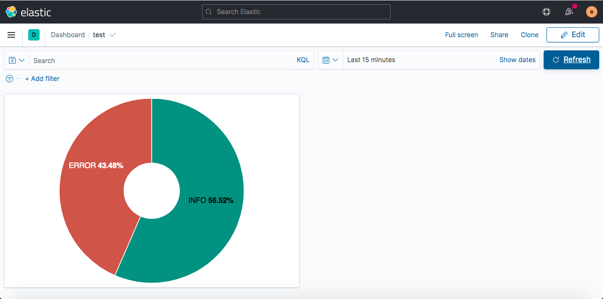

## Och en bra titel här

* Stäng ner docker-elk med Ctrl+C
* Stäng eventuellt också ner (om den var igång) vår bas-applikation. Antagligen inte nödvändigt men kanske är Katacoda lättare om det inte gör alltför mycket samtidigt.
* Öppna logstash.conf (borde fortfarande finnas öppen som tab i editorn)

Nu dags att lägga till egna filter. Berätta att vi kommer använda grok-plugin, länka till https://www.elastic.co/guide/en/logstash/current/plugins-filters-grok.html och http://grokdebug.herokuapp.com/

Ge ett bra exempel på hur grok arbetar för att dela upp text i olika 'fält' (som sedan dyker upp i Kibana, återigen är detta ett betydelsefullt ord).

Detta ska läggas in under filter:

```
## Add your filters / logstash plugins configuration here
filter {
  if [message] =~ "\tat" {
    grok {
      match => ["message", "^(\tat)"]
      add_tag => ["stacktrace"]
    }
  }
  
  grok {
    match => [ "message",
               "%{TIMESTAMP_ISO8601:time}\s*%{WORD:log_level} %{NUMBER:pid} --- .+? :\s+(?<logmessage>.*)"
             ]
  }
}
```

senare kommer vi även extrahera:
* vem blev greeted i /greeting
* vad hände i /calculator

Iaf, så startar vi docker-elk igen:

`docker-compose up`{{execute}}

(återigen, säg att man måste vänta tills det börjar dyka upp terminal-output med elasticsearch_1 och kibana_1 osv)

Sen startar vi vår bas-applikation för att få fler loggmeddelanden.

Går in i Kibana igen och ser att nya 'fields' dykt upp (log-level).

Gå in i Dashboard och skapa en donut-chart baserat på log-level.

Testar att lägga in en bild:

