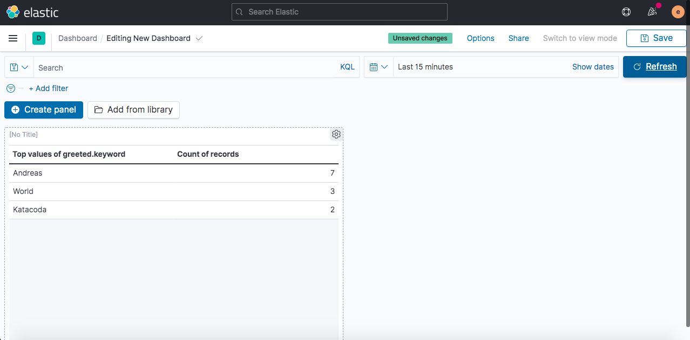

Once again navigate to the hamburger menu and this time click the `Dashboard` just below `Discover`. Click `Create a new dashboard`, then `Create panel`, and choose `Lens`. You can now drag one of the fields from the left into the middle area and a graph will automatically be created for that field.


Gå in i Dashboard och skapa en donut-chart baserat på log-level.

Såhär ser det ut när den är skapad:


Och sen anropar vi `/generate-errors`-endpointen:


Och klickar sedan på Refresh i dashboarden för att se:


<hr>

...

Lägg in detta för att extrahera vem som hälsas på:

```
grok {
    match => [ "logmessage",
               "Greeted: %{WORD:greeted}"
             ]
  }
```

kan ev. skapa lista sen över vilka som hälsas mest på (och hur många ggr), ser ut såhär:


Och sen anropar vi `/greeting`-endpointen några ggr och klickar sedan på Refresh i dashboarden för att se:

