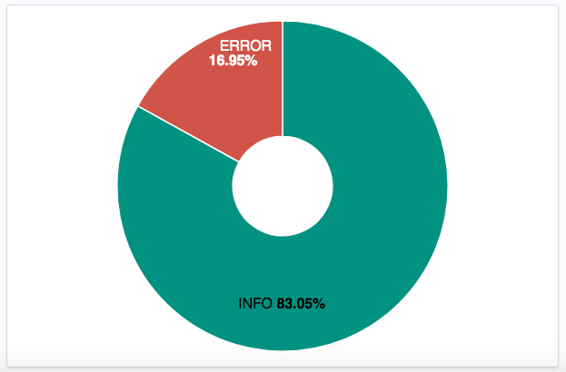
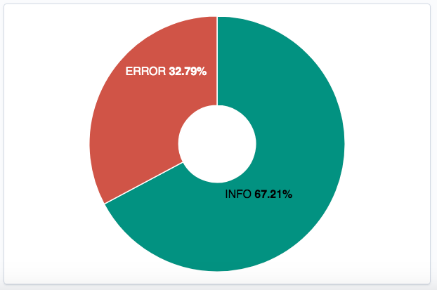
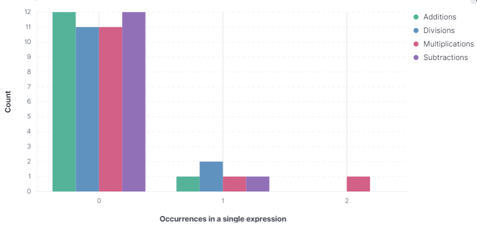

## Creating data visualizations with Kibana Dashboard

Once again, navigate to the hamburger menu and this time click on `Dashboard`, just below `Discover`. Click `Create a new dashboard`, then `Create panel`, and choose `Lens`. You can now drag one of the fields from the left into the middle area and a graph will automatically be created for that field.

The default suggestions of Kibana when you try this with different fields will not always be exactly what you want, however. So, we will now showcase three different ways you can visualize data. The first two are relatively simple, and the third one is a bit more involved.

## Ratio of info to error message

Pick the `Donut` chart-type from the dropdown. From the left area, drag the `log_level.keyword` field to the middle area. To change the colors to be more indicative, go to the area on the right and click `Top values of log_level.keyword`, scroll down to `Color palette`, and pick *Status* instead of *Default*.

This is what the resulting graph could look like:

If you invoke the `/generate-errors`-endpoint and hit `Refresh`, the graph will change:

## Show who's popular (i.e. most greeted)

Pick the 'Data table' chart-type from the dropdown. From the left area, drag the `greeted.keyword` field to the middle area.

This is what the resulting graph could look like:

## How are people using the calculator?

The calculator has been prepared with multiple logging utilities to allow various visualizations to be made. The following is logged:
- if the calculator is accessed through a GET request (i.e. it is opened through the calculator-endpoint) or a POST request (i.e. the page is reloaded after doing a calculation)
- if the provided expression is valid, invalid, or a division with 0 (which although invalid is separated into its own case)
- assuming the expression is valid, the number of times each operator was encountered in the expression
- and lastly what the numeric value of the result was (given a valid expression)

Feel free to come up with various ways to visualize these results graphically in Kibana. Here, we shall just showcase a few simple examples.

<h4>1. A graph showing the distribution between valid, invalid and zero-division expressions</h4>
Open a new panel of type `Lens`. Drag and drop `calc_expr_validity.keyword` from the left area to the middle area. You should now have a suggested graph for this field. To get the graph shown in the below image, choose the graph type `Pie` in the dropdown just above the graph. If you want to change the color palette, click box under `Slice by` in the area to the right of the graph. Here you have several options, one of which is "Color palette".

You should now have a graph that looks something like this:

<h4>2. A graph showing how many times operators apppear in expressions</h4>  
Open a new panel of type `Lens`. Start with creating 3 additional layers; this can be done by clicking the plus symbol at the bottom of the right area. This is necessary to allow multiple fiedls to be added to a single graph. Next drag and drop `calc_additions.keyword`, `calc_divisions.keyword`, `calc_multiplications.keyword` and `calc_subtractions.keyword` from the left area to the middle area. You should now have a suggested graph for these 4 fields. To get the graph shown in the below image, choose the graph type `Bar` in the dropdown just above the graph. Note: some graph types are not available when having multiple layers; if you choose one of those types (indicated by a warning sign in the dropdown) it will remove some of your layers.
Click the "bar symbols" above the graph to rename the axis.
Next, in the layers to the right click the box under `Vertical axis` to rename the data series. Do this for all 4 layers and then click `Save and return` at the top right of the Kibana interface. 

You should now have a graph that looks something like this:

<h4>3. A graph showing how the traffic of the calculator page varies over time</h4>  
Open a new panel of type `Lens`. Drag and drop `calc_request.keyword` from the left area to the middle area. You should now have a suggested graph for this field. In the area to the right of the graph, click the box under `Horizontal axis` (it probably says "Top values of calc_request.​keyword"). Next choose `Date histogram` at the top. This should automatically give you a time graph for the time period specified previously. If you chose some high value here (that was way above the time you have spent with this tutorial) you might have a rather boring graph with just a bar or 2 to the far right. If you manage to keep the tutorial going for long enough and keep using the calculator, this will become more interesting. But perhaps more interesting for the time being would be to adjust the timeframe to the one you ahve spent in the tutorial. Like before this can be done to the right of the search bar (rembemer to click apply). But you can also click and drag over the area of the graph that you want to "zoom in" on to automatically tighten your timeframe. Doing this a couple of times might give you a graph looking something like the one below. Do note that this timeframe will affect how you view data in the rest of Kibana as well. So in case some of your data appears to be missing you might have to widen your timeframe.

Worth noting is that Kibana automatically chooses the width of the bars for you (for instance that each bar covers 30 seconds in time). You can manually change this in same menu you chose `Date histogram` earlier.

## Final result

Lägg in fin bild på vår Dashboard.